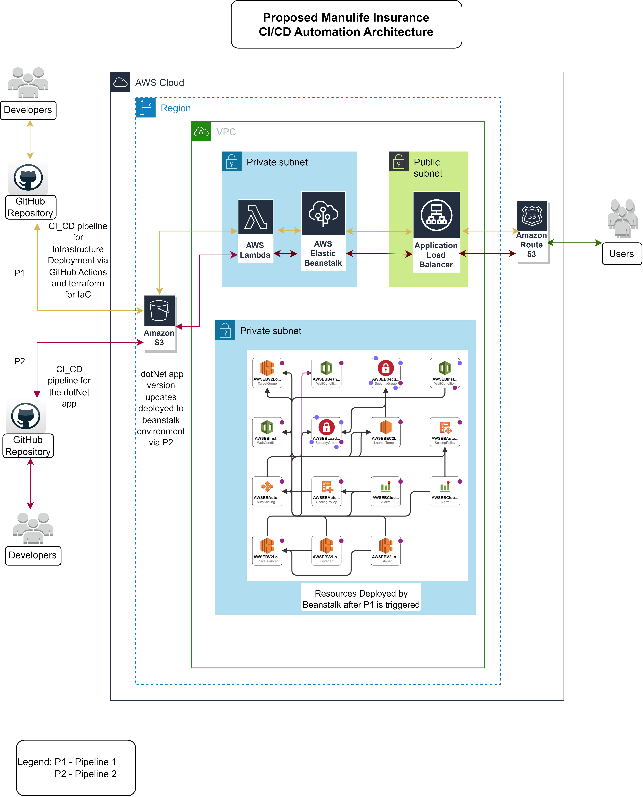

# Manulife Insurance AWS Infrastructure with Elastic Beanstalk, Lambda, Route 53 and S3. 

## Overview

This repository contains Terraform configurations to provision AWS infrastructure consisting of Elastic Beanstalk environment, a Lambda function for automatic deployments, Route 53 for DNS management and an S3 bucket for object storage.

## To run this infrustracture locally configure the prerequisite:

### Prerequisites

- [Terraform](https://www.terraform.io/) installed locally.
- [AWS credentials](https://docs.aws.amazon.com/cli/latest/userguide/getting-started-install.html) configured with the necessary permissions.

### Getting Started

1. Create a new working Directory and change into it:

   ```bash
   mkdir <working_dir> && cd <working_dir>
   ```

2. Clone this repository:

   ```bash
   git clone <https://github.com/michaelkedey/aws_cloudfront_beanstalk_lambda_s3_config.git>
   ```

3. Change into the project repo:

   ```bash
   cd <aws_cloudfront_beanstalk_lambda_s3_config/src/infrastracture>
   ```

4. Run the format script to format all Terraform files:

   ```bash
   ./format_validate_all.sh
   ```

5. Review and customize the variables in `.terraform.tfvars` file inside the **`src/infrastracture/env**/`** drectories, with your specific configuration details.


6. Review and customize the backend in `backend.tfvars` file inside the **`src/infrastracture/env**/`** directories, with your specific configuration details.


7. Initialize Terraform:

   ```bash
   terraform init -var-file=<"./env/**/.terraform.tfvars"> -backend-config=<"./env/**/.backend.tfvars">
   ```

8. Plan Terraform:

   ```bash
   terraform plan -var-file=<"./env/**/.terraform.tfvars">

   ```

9. Apply the Terraform configuration:

   ```bash
   terraform apply -var-file=<"./env/**/.terraform.tfvars"> --auto-approve
   ```

   Follow the prompts to confirm the changes.

## Infrastructure Components



### VPC

- The VPC serves as the underlying network infrastructure on which all other resources are provisioned. The networking for this infrastructure include:
- 1 VPC
- 2 Private Subnets 
- 2 Public Subnets
- 1 NAT Gateway 
- Private and Public Route Tables with Route rules
- 1 Security Group 
- Configuration details can be found in the `vpc.tf` file under `src/infrastracture/modules/vpc/vpc.tf`

### S3 Bucket

- An S3 bucket which serves as the storage for application codes is created as part of the infrastructure. 
- Configuration details can be found in the `s3.tf` file under `src/infrastracture/modules/s3/s3.tf`

### Elastic Beanstalk Environment

- The Elastic Beanstalk environment is deployed in a new VPC and private subnets.
- Configuration details can be found in the `prod_env.tf` file under `src/infrastracture/modules/beanstalk/prod/prod_env.tf`

### Lambda Function

- The Lambda function has an S3 event trigger which runs on the upload of an S3 object into the created bucket. Thereby automatically deploying application updates to Elastic Beanstalk from the S3 bucket.
Lambda is configured to only create application versions from uploads of S3 objects which meet a defined criteria, ensuring only relevant application code get deployed. The criteria is that the code has a `prefix` of **code_** and `suffix` of **.zip**.
- Configuration details can be found in the `lambda_function.tf` file under `src/infrastracture/modules/lambda/lambda.tf`

### Elastic Load Balancer

An elastic load balancer, security group, target groups and listeners for the various services and ports has been provided for.
The elastic load balancer distributes incoming traffic across multiple instances of your web server, such as ec2 instances as defined in the beanstalk environment.
However, depending on your use case, you can associate this load balancer with the beanstalk, or allow beanstalk create it's own load balancer as has been configured.
- Configuration details can be found in the `lb.tf` file under `src/infrastracture/modules/loadbalancer/lb.tf`

### Route 53

- Route 53 is used for DNS management. With this configuration Route 53 creates an A record based on a registered domain name linked to the CNAME of the beanstalk.
- Configuration details can be found in the `route.tf` file under `src/infrastracture/modules/route52/route.tf`.

## Usage

### CI/CD - Infrastructure Pipeline

The CI/CD pipeline uses GitHub Actions defined in yaml files contained in the .github/workflows directory. There are three yaml files for the infrastructure CI/CD. One file for each stage of deployment i.e. development (`dev_actions.yaml` file), staging (`staging_actions.yaml` file) and production (`prod_actions.yaml` file). The dev level is triggered by commit to `branch main` with paths 'src/infrastructure/**'. The staging level deployment is triggered by a successful completion of the `dev_actions.yaml`workflow. The production level is triggered manually and requires manual approval. This is to ensure that production level will be triggered after development and staging meet expectations. 

### CI/CD - Application Pipeline

The CI/CD application pipeline use GitHub Actions also defined in yaml files contained in the .github/workflows directory. There are three yaml files for the application CI/CD. One file for each stage of deployment i.e. development (`dev_s3.yaml` file), staging (`staging_s3.yaml` file) and production (`prod_s3.yaml` file). The dev level is triggered by commit to `branch s3_auto` with paths 'src/s3_auto_uploads/**'. The staging level deployment is triggered by a successful completion of the `dev_s3.yaml`workflow. The production level is triggered manually and requires manual approval so as to ensure that production level will be triggered after development and staging meet expectations. 

The yaml files contain commands that sync `s3_auto_uploads` directory with the respective buckets of the various deployment stages.

The sync causes an upload into the S3 buckets which triggers the lambda if the objects so uploaded satisfy the `prefix` and  `suffix` criteria. The triggered lambda copies the application update and creates and deploys an application version on Elastic Beanstalk. 

- Access your Elastic Beanstalk application using the provided environment URL or custom domain (if configured).

- Monitor Lambda function execution and deployment logs in AWS CloudWatch.

## Cleanup

Three `destroy` yaml files are contained in the .github/workflows directory. These include `dev_destroy.yaml`, `staging_destroy.yaml` and `prod_destroy.yaml`files. They require manual approval to trigger the destroy workflow for the respective deployment levels.  


## Notes

- Make sure to review and update AWS credentials, region, and other sensitive information before committing to version control.

## Contributing

Feel free to contribute to this project by opening issues or creating pull requests.

## Contributors
### Hadari Africa
- [Doreen Dela Agbedoe](https://github.com/DelaDoreen)
- [Konadu Owusu-Ansah](https://github.com/konaydu)
- [Maurice Makafui](https://github.com/Maurice-Makafui)
- [Kwasi Attafua](https://github.com/Kattafuah)
- [Seyram Gabriel](https://github.com/seyramgabriel)
- [Michael Kedey](https://github.com/michaelkedey)
